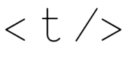

<!-- AUTO-GENERATED-CONTENT:START (STARTER) -->

  

<h1 align="center">
TypeOfNaN JavaScript Reference
</h1>

### 🚀 View the Reference

The reference can be found online at https://reference.typeofnan.dev

### 📖 Introduction

This project was created as a simplified reference for JavaScript concepts. Rather than diving deeply into concepts, it takes a "simplicity first" approach.

### ⚙ Simplicity First

Each page in this reference walks you through a concept line-by-line, offering a relatively simple use case rather than a deep dive. This is intentional&mdash;there are plenty of incredible deep-dive references (e.g., MDN) should you want to learn all the ins and outs of a concept, but those references can also be quite intimidating to newcomers.

### 👥 Contributing

Currently, this is an internally-maintained project, but suggestions for topics to cover are always appreciated! To suggest a topic, please open a Github issue for discussion.
